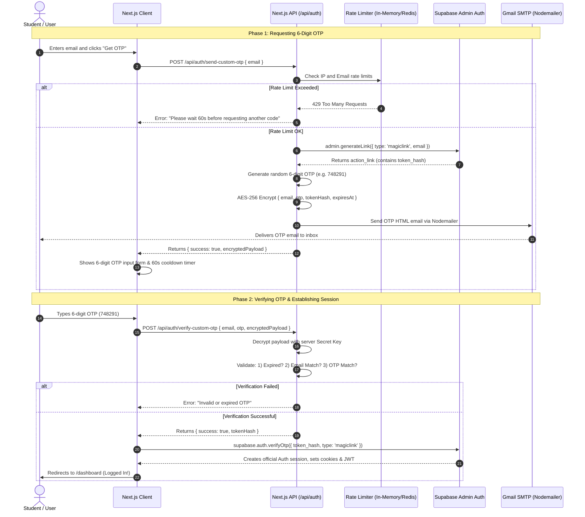

# 🚀 Complete Guide: Production-Ready Stateless OTP System Using a Normal Gmail Account & Supabase Auth (with Gmail Anti-Ban Rate Limiting), (create a fresh email for this to work perfectly).

---

## 📌 Executive Summary & Motivation

When building authentication for modern web applications using BaaS (Backend-as-a-Service) providers like **Supabase**, developers often hit severe roadblocks when using regular Gmail accounts for transactional emails:

1. **Cloud IP Blacklisting & `535 BadCredentials` Errors:** Hosted auth services (like Supabase Auth / GoTrue) attempt to connect to Google's SMTP from AWS/GCP data centers. Google frequently flags these data center IPs as suspicious, returning `535 5.7.8 BadCredentials` even with valid App Passwords.
2. **Strict Sending Limits:** Free personal Gmail accounts have a hard cap of **500 emails per rolling 24-hour period**. Exceeding this or sending rapid burst emails immediately locks SMTP access.
3. **Third-Party Email Costs:** Dedicated transactional email providers (SendGrid, Postmark, AWS SES) often require paid subscriptions, custom domain verification, and DNS record approvals (SPF/DKIM/DMARC), which is cumbersome for student hackathons, MVP launches, or college portals.

### 💡 The Solution Architecture

This strategy creates a **100% free, stateless, secure OTP & Magic Link authentication engine** that:
- Runs email dispatch directly on your application server (Vercel / Node.js) via `nodemailer` using a standard `@gmail.com` account.
- Utilizes the **Supabase Admin API** (`generateLink`) to create cryptographic authentication tokens in-memory without Supabase sending any emails.
- Encrypts the OTP session payload client-side (`AES-256-CBC`), eliminating the need for temporary database OTP tables or cleanup cron jobs.
- Implements a **multi-layered rate limiter** (Per-Email + Per-IP + Cooldown) to guarantee your Gmail account **never exceeds limits or gets blocked**.

---

## 🏗️ Architecture & Authentication Flow



---

## ⚙️ Step 1: Gmail Account & Google App Password Setup

To allow `nodemailer` to send emails via Gmail, you **must not** use your regular Google login password. You must create a **16-character App Password**.

### Instructions:
1. Go to your [Google Account Security Settings](https://myaccount.google.com/security).
2. Enable **2-Step Verification** (if not already enabled).
3. Search for **App Passwords** in the search bar (or visit [https://myaccount.google.com/apppasswords](https://myaccount.google.com/apppasswords)).
4. Enter an App name (e.g., `JobFair Web App`) and click **Create**.
5. Google will display a 16-character password formatted as: `xxxx yyyy zzzz wwww`.
6. **IMPORTANT:** Note down this password. In your environment variables, you can keep or remove spaces (Nodemailer accepts both).

---

## 🔑 Step 2: Environment Variables (`.env.local`)

Add the following variables to your `.env.local` file:

```env
# Supabase Configuration
NEXT_PUBLIC_SUPABASE_URL=https://your-project-id.supabase.co
NEXT_PUBLIC_SUPABASE_ANON_KEY=your-anon-public-key
SUPABASE_SERVICE_ROLE_KEY=your-service-role-secret-key-from-supabase-dashboard

# Gmail SMTP Configuration
GMAIL_USER=your_custom_email@gmail.com
GMAIL_APP_PASSWORD=xxxx yyyy zzzz wwww
EMAIL_FROM_NAME="Your Organization / Event Name"
```

> ⚠️ **CRITICAL SECURITY NOTE:** Never expose `SUPABASE_SERVICE_ROLE_KEY` or `GMAIL_APP_PASSWORD` to the frontend. They must only be accessed inside Next.js Server Components, API routes, or server actions.

---

## 🛡️ Step 3: Core Implementation Files

### 1. Cryptographic Helper (`src/lib/crypto.ts`)
This module encrypts the OTP session payload on the server and returns a signed ciphertext string to the frontend. This makes the system **100% stateless** without needing any database storage.

```typescript
// src/lib/crypto.ts
import crypto from 'crypto'

const ENCRYPTION_KEY = process.env.SUPABASE_SERVICE_ROLE_KEY
  ? process.env.SUPABASE_SERVICE_ROLE_KEY.slice(0, 32).padEnd(32, '0') // 256 bits (32 bytes)
  : 'fallback_dev_secret_key_pad_32b'

const IV_LENGTH = 16 // AES block size

export function encryptPayload(payload: object): string {
  const text = JSON.stringify(payload)
  const iv = crypto.randomBytes(IV_LENGTH)
  const cipher = crypto.createCipheriv('aes-256-cbc', Buffer.from(ENCRYPTION_KEY), iv)
  let encrypted = cipher.update(text)
  encrypted = Buffer.concat([encrypted, cipher.final()])
  return iv.toString('hex') + ':' + encrypted.toString('hex')
}

export function decryptPayload<T>(encryptedText: string): T | null {
  try {
    const textParts = encryptedText.split(':')
    const ivHex = textParts.shift()
    if (!ivHex) return null
    
    const iv = Buffer.from(ivHex, 'hex')
    const encryptedData = Buffer.from(textParts.join(':'), 'hex')
    const decipher = crypto.createDecipheriv('aes-256-cbc', Buffer.from(ENCRYPTION_KEY), iv)
    let decrypted = decipher.update(encryptedData)
    decrypted = Buffer.concat([decrypted, decipher.final()])
    
    return JSON.parse(decrypted.toString()) as T
  } catch (error) {
    console.error('Decryption failed or tamper detected:', error)
    return null
  }
}
```

---

### 2. Gmail Protection & Anti-Ban Rate Limiter (`src/lib/rateLimiter.ts`)

To protect your Gmail account from being flagged or hitting the 500/day limit, we enforce:
1. **Per-Email Cooldown:** Maximum 1 OTP request every 60 seconds.
2. **Per-Email Limit:** Maximum 5 OTP requests per hour.
3. **Per-IP Limit:** Maximum 15 OTP requests per hour (stops bots flooding from a single IP).
4. **Global Daily Safety Counter:** Warns or blocks once 450 requests are reached in 24 hours to prevent account lockout.

```typescript
// src/lib/rateLimiter.ts

interface RateLimitRecord {
  lastRequestedAt: number
  hourlyCount: number
  hourlyWindowStart: number
}

// In-Memory storage (For production across multiple serverless instances, use Upstash Redis)
const emailLimits = new Map<string, RateLimitRecord>()
const ipLimits = new Map<string, RateLimitRecord>()

const COOLDOWN_MS = 60 * 1000 // 60 seconds between resends
const HOURLY_WINDOW_MS = 60 * 60 * 1000 // 1 hour window
const MAX_REQUESTS_PER_EMAIL_HOURLY = 5
const MAX_REQUESTS_PER_IP_HOURLY = 15

export function checkRateLimit(email: string, ip: string): { allowed: boolean; message?: string } {
  const now = Date.now()
  const cleanEmail = email.toLowerCase().trim()

  // 1. Check Email Cooldown & Hourly Limit
  const emailRecord = emailLimits.get(cleanEmail) || {
    lastRequestedAt: 0,
    hourlyCount: 0,
    hourlyWindowStart: now,
  }

  // Reset hourly window if expired
  if (now - emailRecord.hourlyWindowStart > HOURLY_WINDOW_MS) {
    emailRecord.hourlyCount = 0
    emailRecord.hourlyWindowStart = now
  }

  // Check 60-second cooldown
  if (now - emailRecord.lastRequestedAt < COOLDOWN_MS) {
    const remainingSecs = Math.ceil((COOLDOWN_MS - (now - emailRecord.lastRequestedAt)) / 1000)
    return {
      allowed: false,
      message: `Please wait ${remainingSecs}s before requesting another OTP.`,
    }
  }

  // Check hourly quota per email
  if (emailRecord.hourlyCount >= MAX_REQUESTS_PER_EMAIL_HOURLY) {
    return {
      allowed: false,
      message: 'Too many OTP requests for this email. Please try again in an hour.',
    }
  }

  // 2. Check IP Hourly Limit
  const ipRecord = ipLimits.get(ip) || {
    lastRequestedAt: 0,
    hourlyCount: 0,
    hourlyWindowStart: now,
  }

  if (now - ipRecord.hourlyWindowStart > HOURLY_WINDOW_MS) {
    ipRecord.hourlyCount = 0
    ipRecord.hourlyWindowStart = now
  }

  if (ipRecord.hourlyCount >= MAX_REQUESTS_PER_IP_HOURLY) {
    return {
      allowed: false,
      message: 'Too many requests from this network. Please try again later.',
    }
  }

  // Update records
  emailRecord.lastRequestedAt = now
  emailRecord.hourlyCount += 1
  emailLimits.set(cleanEmail, emailRecord)

  ipRecord.lastRequestedAt = now
  ipRecord.hourlyCount += 1
  ipLimits.set(ip, ipRecord)

  return { allowed: true }
}
```

---

### 3. OTP Dispatch API (`src/app/api/auth/send-custom-otp/route.ts`)

This endpoint orchestrates Supabase token generation, rate-limit checks, and email dispatching via Gmail SMTP.

```typescript
// src/app/api/auth/send-custom-otp/route.ts
import { NextResponse } from 'next/server'
import { createClient } from '@supabase/supabase-js'
import nodemailer from 'nodemailer'
import { encryptPayload } from '@/lib/crypto'
import { checkRateLimit } from '@/lib/rateLimiter'

const SUPABASE_URL = process.env.NEXT_PUBLIC_SUPABASE_URL || ''
const SUPABASE_SERVICE_KEY = process.env.SUPABASE_SERVICE_ROLE_KEY || ''
const GMAIL_USER = process.env.GMAIL_USER || ''
const GMAIL_APP_PASSWORD = process.env.GMAIL_APP_PASSWORD || ''
const FROM_NAME = process.env.EMAIL_FROM_NAME || 'JobFair Portal'

// Reusable Nodemailer Transporter (Connection Pooling enabled)
const transporter = nodemailer.createTransport({
  host: 'smtp.gmail.com',
  port: 465,
  secure: true, // SSL
  auth: {
    user: GMAIL_USER,
    pass: GMAIL_APP_PASSWORD,
  },
  pool: true,
  maxConnections: 3,
  maxMessages: 50,
})

export async function POST(request: Request) {
  try {
    const { email } = await request.json()
    const clientIp = request.headers.get('x-forwarded-for')?.split(',')[0] || '127.0.0.1'

    if (!email || !email.includes('@')) {
      return NextResponse.json({ error: 'A valid email address is required.' }, { status: 400 })
    }

    // 1. Enforce Gmail Protection Rate Limiting
    const rateLimit = checkRateLimit(email, clientIp)
    if (!rateLimit.allowed) {
      return NextResponse.json({ error: rateLimit.message }, { status: 429 })
    }

    if (!SUPABASE_SERVICE_KEY || !GMAIL_USER || !GMAIL_APP_PASSWORD) {
      return NextResponse.json({ error: 'Server authentication configuration missing.' }, { status: 500 })
    }

    // 2. Generate 6-Digit Numeric OTP
    const otp = Math.floor(100000 + Math.random() * 900000).toString()

    // 3. Generate Supabase Token without sending Supabase emails
    const adminClient = createClient(SUPABASE_URL, SUPABASE_SERVICE_KEY)
    const { data: linkData, error: linkError } = await adminClient.auth.admin.generateLink({
      type: 'magiclink',
      email: email.trim().toLowerCase(),
    })

    if (linkError || !linkData?.properties?.action_link) {
      console.error('Supabase generateLink error:', linkError)
      return NextResponse.json({ error: 'Failed to generate authentication session.' }, { status: 500 })
    }

    // Extract token_hash from action_link URL
    const url = new URL(linkData.properties.action_link)
    const tokenHash = url.searchParams.get('token')

    if (!tokenHash) {
      return NextResponse.json({ error: 'Could not extract authentication token.' }, { status: 500 })
    }

    // 4. Send Clean, High-Deliverability HTML Email via Gmail
    const mailOptions = {
      from: `"${FROM_NAME}" <${GMAIL_USER}>`,
      to: email,
      subject: `Your Verification Code: ${otp}`,
      html: `
        <div style="font-family: -apple-system, BlinkMacSystemFont, 'Segoe UI', Roboto, Helvetica, sans-serif; max-width: 480px; margin: 0 auto; padding: 24px; border: 1px solid #e2e8f0; border-radius: 12px; background: #ffffff;">
          <h2 style="color: #0f172a; text-align: center; margin-bottom: 8px;">Verify Your Identity</h2>
          <p style="color: #475569; font-size: 15px; line-height: 1.5; text-align: center;">Use the following one-time verification code to sign in. This code is valid for <strong>30 minutes</strong>.</p>
          
          <div style="background-color: #f8fafc; border: 1px dashed #cbd5e1; border-radius: 8px; padding: 18px; text-align: center; margin: 24px 0;">
            <span style="font-size: 32px; font-weight: 800; letter-spacing: 6px; color: #8c1515; font-family: monospace;">${otp}</span>
          </div>

          <p style="color: #94a3b8; font-size: 12px; text-align: center;">If you didn't request this code, you can safely ignore this email.</p>
        </div>
      `,
    }

    await transporter.sendMail(mailOptions)

    // 5. Encrypt Payload for the Frontend (30 Minute Validity)
    const payload = {
      email: email.trim().toLowerCase(),
      otp,
      tokenHash,
      expiresAt: Date.now() + 30 * 60 * 1000, // 30 minutes
    }

    const encryptedPayload = encryptPayload(payload)

    return NextResponse.json({ success: true, encryptedPayload })
  } catch (error: any) {
    console.error('OTP Send Route Error:', error)
    return NextResponse.json({ error: error.message || 'Internal server error.' }, { status: 500 })
  }
}
```

---

### 4. OTP Verification API (`src/app/api/auth/verify-custom-otp/route.ts`)

```typescript
// src/app/api/auth/verify-custom-otp/route.ts
import { NextResponse } from 'next/server'
import { decryptPayload } from '@/lib/crypto'

interface OtpPayload {
  email: string
  otp: string
  tokenHash: string
  expiresAt: number
}

export async function POST(request: Request) {
  try {
    const { email, otp, encryptedPayload } = await request.json()

    if (!email || !otp || !encryptedPayload) {
      return NextResponse.json({ error: 'Email, OTP, and session payload are required.' }, { status: 400 })
    }

    // 1. Decrypt and verify payload integrity
    const payload = decryptPayload<OtpPayload>(encryptedPayload)

    if (!payload) {
      return NextResponse.json({ error: 'Invalid or tampered verification session.' }, { status: 400 })
    }

    // 2. Check Expiration
    if (Date.now() > payload.expiresAt) {
      return NextResponse.json({ error: 'This OTP has expired. Please request a new one.' }, { status: 400 })
    }

    // 3. Check Email Match
    if (payload.email.toLowerCase() !== email.toLowerCase().trim()) {
      return NextResponse.json({ error: 'Email address mismatch.' }, { status: 400 })
    }

    // 4. Verify 6-digit OTP
    if (payload.otp !== otp.trim()) {
      return NextResponse.json({ error: 'Incorrect OTP. Please check your email and try again.' }, { status: 400 })
    }

    // 5. Success! Return the real Supabase tokenHash to the client
    return NextResponse.json({ success: true, tokenHash: payload.tokenHash })
  } catch (error: any) {
    console.error('OTP Verification Error:', error)
    return NextResponse.json({ error: 'Internal server error during verification.' }, { status: 500 })
  }
}
```

---

### 5. Client Integration Example (`src/app/auth/page.tsx`)

Here is the essential client-side logic to hook up the OTP request and verification with Supabase:

```tsx
'use client'

import { useState, useEffect } from 'react'
import { createBrowserClient } from '@supabase/ssr'

export default function AuthPage() {
  const [email, setEmail] = useState('')
  const [otp, setOtp] = useState('')
  const [otpSent, setOtpSent] = useState(false)
  const [encryptedPayload, setEncryptedPayload] = useState<string | null>(null)
  const [cooldown, setCooldown] = useState(0)
  const [loading, setLoading] = useState(false)
  const [error, setError] = useState<string | null>(null)

  const supabase = createBrowserClient(
    process.env.NEXT_PUBLIC_SUPABASE_URL!,
    process.env.NEXT_PUBLIC_SUPABASE_ANON_KEY!
  )

  // Countdown timer for resend button
  useEffect(() => {
    if (cooldown > 0) {
      const timer = setTimeout(() => setCooldown(cooldown - 1), 1000)
      return () => clearTimeout(timer)
    }
  }, [cooldown])

  // Phase 1: Request OTP
  const handleSendOtp = async (e: React.FormEvent) => {
    e.preventDefault()
    setLoading(true)
    setError(null)

    try {
      const res = await fetch('/api/auth/send-custom-otp', {
        method: 'POST',
        headers: { 'Content-Type': 'application/json' },
        body: JSON.stringify({ email }),
      })
      const data = await res.json()

      if (!res.ok) throw new Error(data.error || 'Failed to send OTP')

      setEncryptedPayload(data.encryptedPayload)
      setOtpSent(true)
      setCooldown(60) // Start 60-second cooldown
    } catch (err: any) {
      setError(err.message)
    } finally {
      setLoading(false)
    }
  }

  // Phase 2: Verify OTP and Login
  const handleVerifyOtp = async (e: React.FormEvent) => {
    e.preventDefault()
    setLoading(true)
    setError(null)

    try {
      const res = await fetch('/api/auth/verify-custom-otp', {
        method: 'POST',
        headers: { 'Content-Type': 'application/json' },
        body: JSON.stringify({ email, otp, encryptedPayload }),
      })
      const data = await res.json()

      if (!res.ok) throw new Error(data.error || 'Verification failed')

      // Exchange tokenHash for full Supabase Auth Session
      const { error: sessionError } = await supabase.auth.verifyOtp({
        token_hash: data.tokenHash,
        type: 'magiclink',
      })

      if (sessionError) throw sessionError

      // User is now authenticated with JWT & HTTP-Only cookies!
      window.location.href = '/dashboard'
    } catch (err: any) {
      setError(err.message)
    } finally {
      setLoading(false)
    }
  }

  return (
    <div className="max-w-md mx-auto p-6 bg-white rounded-xl shadow-md">
      <h2 className="text-xl font-bold text-center mb-4">
        {otpSent ? 'Enter Verification Code' : 'Sign in with OTP'}
      </h2>

      {error && <div className="p-3 mb-4 text-sm text-red-700 bg-red-100 rounded-lg">{error}</div>}

      {!otpSent ? (
        <form onSubmit={handleSendOtp} className="space-y-4">
          <input
            type="email"
            required
            placeholder="Enter your email"
            value={email}
            onChange={(e) => setEmail(e.target.value)}
            className="w-full p-3 border rounded-lg"
          />
          <button
            type="submit"
            disabled={loading || cooldown > 0}
            className="w-full py-3 bg-red-700 text-white font-semibold rounded-lg hover:bg-red-800 disabled:opacity-50"
          >
            {loading ? 'Sending...' : cooldown > 0 ? `Resend in ${cooldown}s` : 'Get OTP'}
          </button>
        </form>
      ) : (
        <form onSubmit={handleVerifyOtp} className="space-y-4">
          <input
            type="text"
            maxLength={6}
            required
            placeholder="6-digit code"
            value={otp}
            onChange={(e) => setOtp(e.target.value.replace(/\D/g, ''))}
            className="w-full p-3 text-center text-2xl tracking-widest font-mono border rounded-lg"
          />
          <button
            type="submit"
            disabled={loading || otp.length !== 6}
            className="w-full py-3 bg-red-700 text-white font-semibold rounded-lg hover:bg-red-800 disabled:opacity-50"
          >
            {loading ? 'Verifying...' : 'Verify & Sign In'}
          </button>
          <button
            type="button"
            onClick={() => setOtpSent(false)}
            className="w-full text-sm text-gray-500 hover:underline"
          >
            Change Email
          </button>
        </form>
      )}
    </div>
  )
}
```

---

## 🔒 Gmail Anti-Ban & Deliverability Best Practices

To ensure your Gmail account is never flagged or throttled:

| Strategy | Rule / Parameter | Why It Protects Your Account |
| :--- | :--- | :--- |
| **Resend Cooldown** | 60 seconds per email | Prevents users or attackers from spamming the "Send OTP" button repeatedly. |
| **Hourly Rate Cap** | 5 emails / email / hr | Blocks automated loops or dictionary attacks targeting specific users. |
| **IP Rate Cap** | 15 emails / IP / hr | Stops automated bots and scrapers from burning your 500 daily email allowance. |
| **Connection Pooling** | `pool: true, maxConnections: 3` | Reuses existing SMTP sockets instead of opening hundreds of simultaneous SSL handshakes. |
| **Subject Line Clarity** | Dynamic Subject (`Your code: 123456`) | Prevents Google spam algorithms from marking identical repetitive subjects as automated spam. |
| **Domain Validation** | Validate regex / college domains | Avoids sending emails to non-existent addresses (bounces damage your Gmail sender reputation). |

---

## 📊 Summary of Advantages

1. **Zero External Email Costs:** Works 100% free with any regular `@gmail.com` account.
2. **Bypasses Supabase Cloud IP Issues:** Eliminates `535 BadCredentials` and `500 Internal Server Error` caused by Supabase SMTP.
3. **No Database Clutter:** Tokens and OTPs are stored inside stateless AES-256 encrypted payloads.
4. **Seamless Supabase Auth Compatibility:** Establishes official sessions, RLS security policies, and user profiles identically to native Supabase magic links.
  